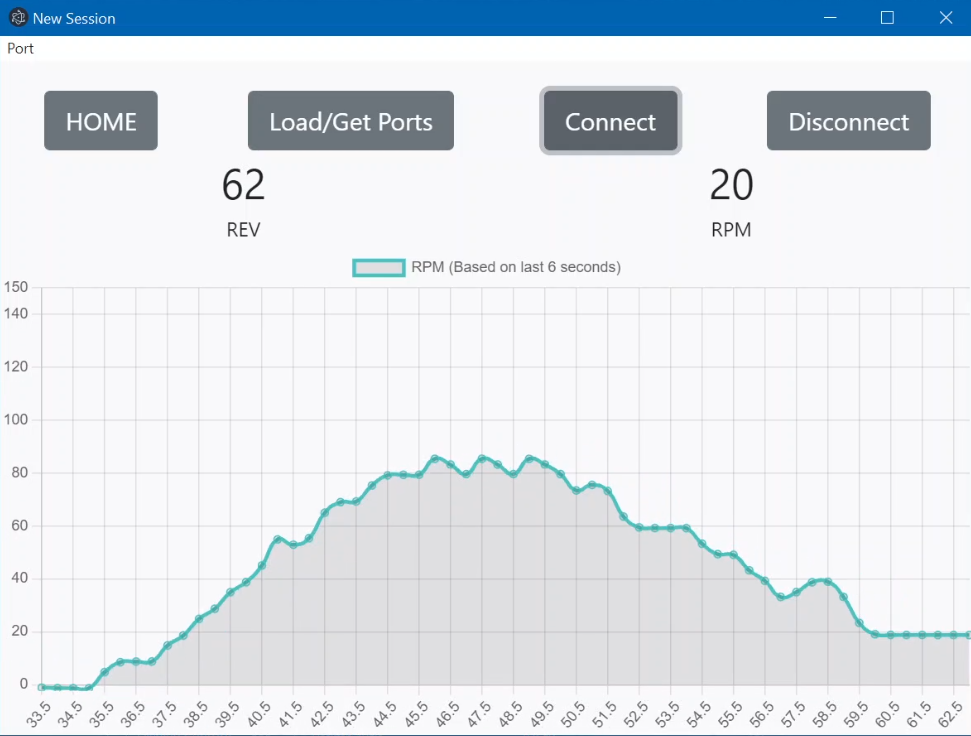

### Sensor
Sensor implementations can differ as long as it transmits the total amount of revolutions - does not have to be an integer. 

### Visualizer
```
npm ci     // Clean Install

npm start   // Start app
```
#### Usage:
1. Click "Load/Get Ports" to load ports into menu
2. Select port in menu
3. Click "Load/Get Ports" to select port
4. Click "Connect" to connect and stream data
5. Click "Disconnect" to disconnect and close stream


